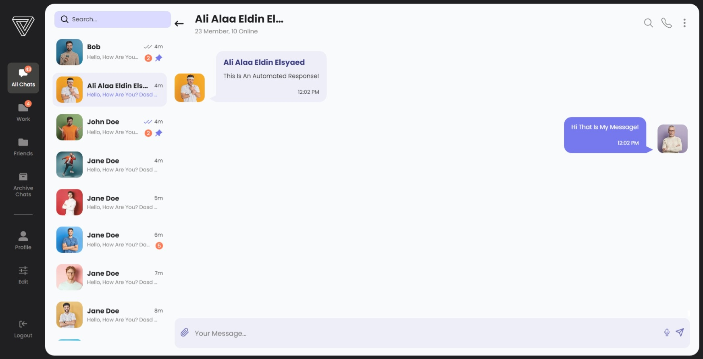
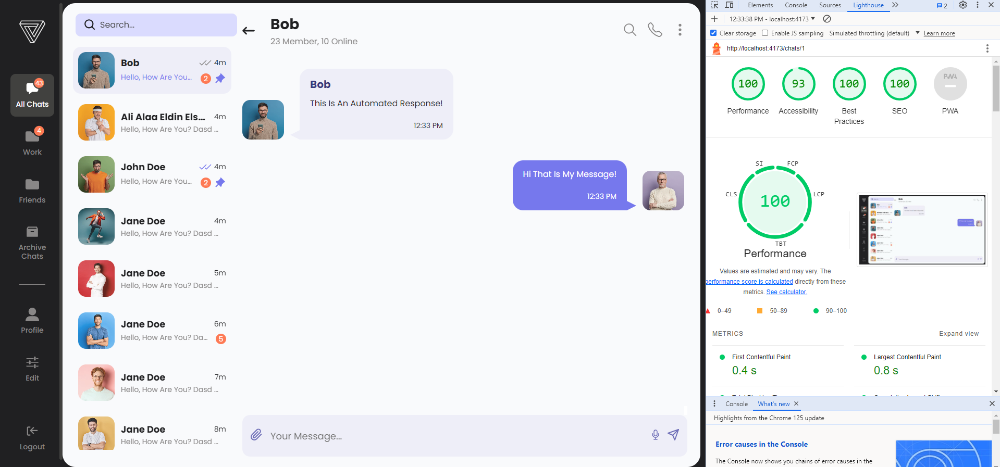

# chat-room

Welcome to the Simple Chat App! This application simulates a real chat interface with interactive and functional features.
## preview
1. **Live Preview**: https://chat-room-ali-alaa-eldin.vercel.app
2. **Screenshot**:  
3. **lighthouse statistics:**
## Features

-   **Interactive Chat Interface**: Engage in a seamless chat experience.
-   **Scrollable Message Area**: Easily scroll through your conversation history.
-   **Automated Responses**: Simulated responses from "the other user" appear a few seconds after you send a message.

## Getting Started

### Prerequisites

Ensure you have the following installed on your system:

-   [Node.js](https://nodejs.org/) (for running the development server)
-   [npm](https://www.npmjs.com/) (Node Package Manager)

### Installation

1. Clone the repository:

    ```sh
    git clone https://github.com/alialaa932003/chat-room.git
    ```

2. Navigate to the project directory:

    ```sh
    cd chat-room
    ```

3. Install the dependencies:

    ```sh
    npm install
    ```

### Running the Application

Start the development server:

```sh
npm run dev
```

## Future improvements

Future Improvements
If I have more time, I plan to implement the following features to enhance the functionality of the chat application:

-   **User Search:** Add a feature to search through the user list.
-   **Collapsed Sidebar:** Collapsing the sidebar would help maximize the chat interface's space, especially on smaller screens, providing a cleaner and more focused chatting experience.
-   **Advanced Features:** Include features like message notifications, typing indicators, and user presence status.
  


